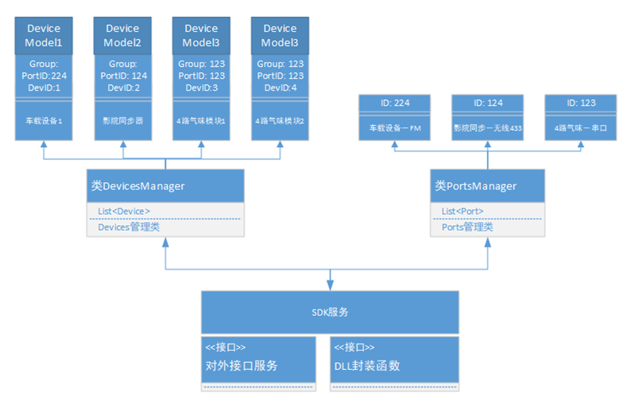
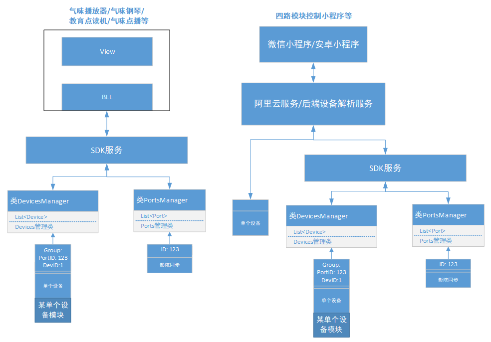
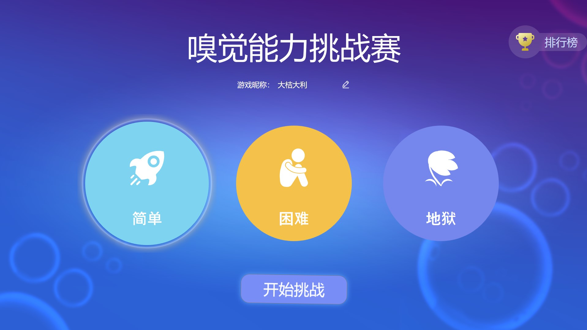
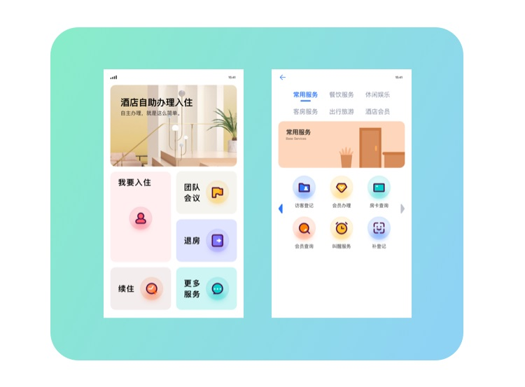
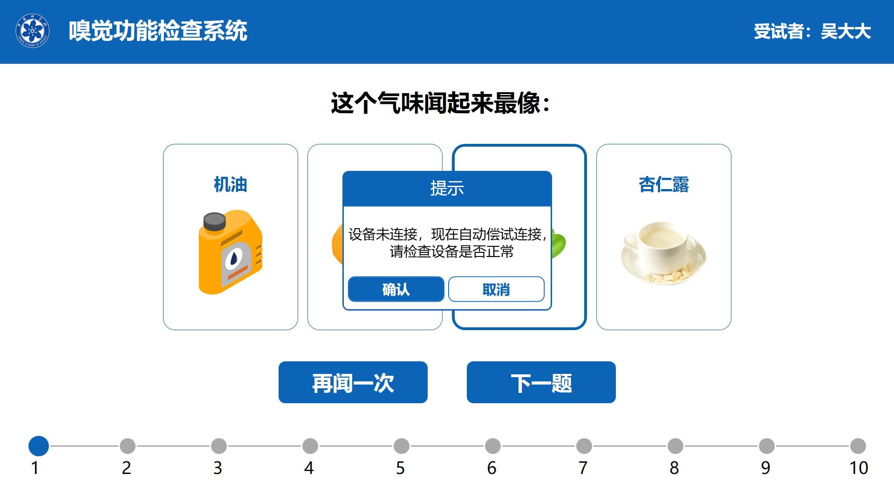
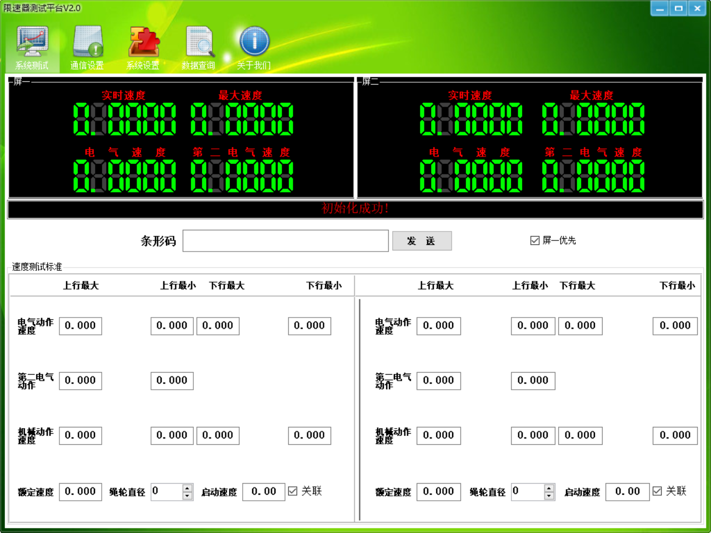
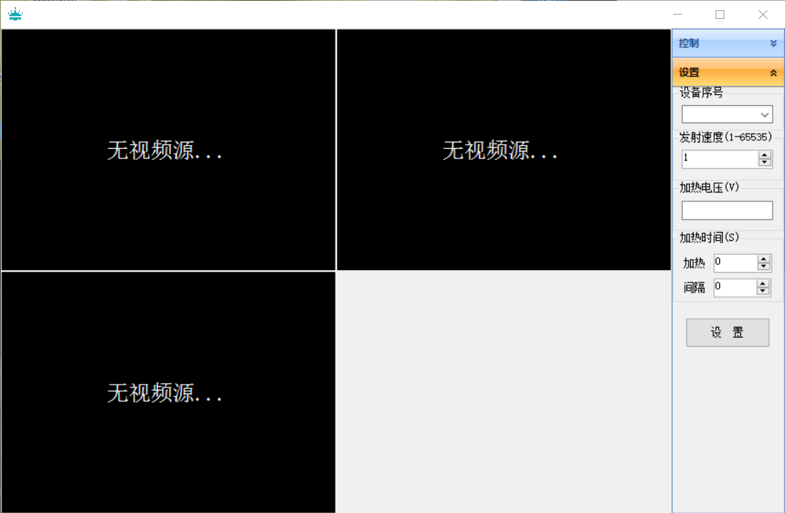

# 物联网平台

&emsp;&emsp;本平台是在个人做物联网整个开发过程中经验集合，通过底层架构的底层通信服务，可以很快集成各类设备的集成控制。

## 软件架构
软件架构说明: 底层可以组网或者单独控制，结构如下图所示：

### 示例1：嗅觉能力挑战赛

### 示例2：酒店入住自助机

### 示例3：科嗅仪

### 示例4：限速器测试系统

### 示例4：气味涡环炮

### 各模块介绍

####1.  Audio音频处理模块
&emsp;&emsp;此模块用于处理音频播放，WAV文件构造，接收WAV流并播放的模块，处理监听广播系统时使用。

####2.  Communication模块
&emsp;&emsp;此模块集成TCP，UDP，串口，蓝牙等常用通信的实现模块。

####3.  DapperExtend模块
&emsp;&emsp;此模块是对orm框架Dapper的扩展，增加了MSSQL，SQLite，Oracle数据库的支持，常用的增删改查比较方便。

####4.  DataBases模块
&emsp;&emsp;此模块原生数据库SQL语句增删改查的模块，包括Access, Oracle, MSSQL, Sqlite以及MySQL的支持。

####5. Devices模块

&emsp;&emsp;Devices此模块集成了常用的BUS，如UDP，TCP，串口，以及对通道的定义，常用西门子PLC；协议接口，设备接连接口；数据总线接口的定义；以及简单协议的定义；项目中广泛使用

####6. JSON模块
&emsp;&emsp;用于对JSON序列化和反序列化的操作，BSON目前没集成进来，后面的Protobuf为新的序列化方法，未统一合成一个模块；

####7. Log4NetEx模块

&emsp;&emsp;此模块为日志模块，是对Log4Net的扩展应用；

####8. Logs模块

&emsp;&emsp;此模块为原生的日志写模块，由一个主线程在不断的控制日志的读写，简单方便，可以生成多个类型的日志，项目中广泛使用。

####9. LuaScript模块

&emsp;&emsp;此模块是为了方便C#写的模块的扩展，方便LUA脚本调用C#模块的额外需求，适用于组态软件增加对数据的处理等功能。

####10. NetBase模块
&emsp;&emsp;此模块集成了常用的Http请求，WebServicer的请求，以及下载文件等功能。

####11. Protobuf模块
&emsp;&emsp;此模块对Google的Protobuf的集成，序列化和反序列化的简单封装。

####12. SecurityUtil模块
&emsp;&emsp;此模块集成了DES，RSA等常用的加解密，以及生成验证码功能的集成。

####13. Util的集成

&emsp;&emsp;此模块集成了众多各种小功能，使用的范围比较广泛，包括依赖属性帮助类，CRC帮助类，Csv,Ini，Excel文件操作，XML序列化操作，MD5加密帮助类，图像处理(生成缩略图，增加水印，调整光暗，反色处理，拉伸，滤色，左右翻转，上下翻转，图片灰度等常用功能)等，也包括日历时间处理，系统一些操作，任务处理，阿拉伯数字转换为汉字大写，反射帮助类。

